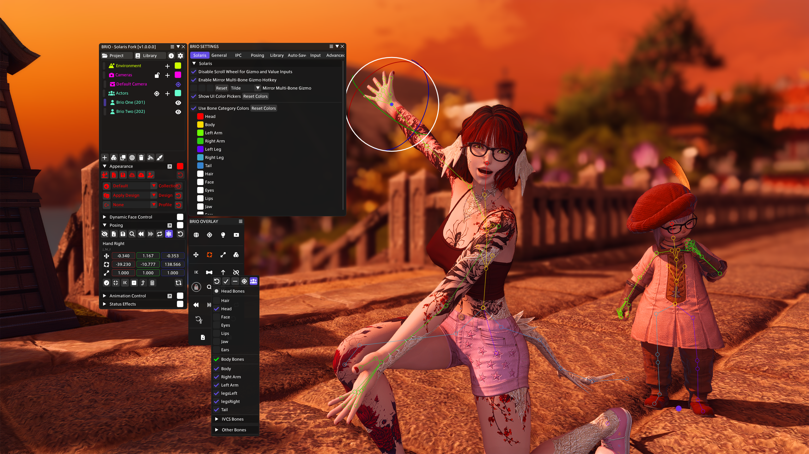

# Changes/Added Features (Fork of Brio 0.7.1.1)

## Version 4 Changelog

### New Features
- **Light direction visualization**: When a light is selected, the overlay draws a yellow line showing the light's forward direction so you can quickly see where the light is pointing.

Merged in changes from Brio v0.7.1.2

## Version 3 Changelog

### New Features
- **Customizable Scroll Bar Size**: Added slider in Solaris tab to adjust the size of scroll bars that appear in the main Brio window when it overflows with widgets. Range from default size (9.0) up to 3 times the default (27.0).
- **Advanced Posing Actor Cycling Buttons**: Added buttons in the Advanced Posing window to cycle between actors.
- **Ctrl+ScrollWheel Shortcuts**: Hold `Ctrl` and scroll the mouse wheel over certain UI elements to quickly cycle values for Weather, Sky Textures, and Particle Textures!

## Version 2 Changelog

### New Features
- **Auto-Select Model Transform and Light Origin**: Added setting in Solaris tab that automatically selects the Model Transform bone when clicking on an Actor in the hierarchy or overlay. For Lights, it selects the light and its transform for immediate editing. Disabled by default.
- **Move to Camera Position Button**: Added button in the Brio Overlay menu that moves the currently selected Actor or Light to the camera's current position and rotation. For Lights, the rotation matches where the camera is looking (works with both regular cameras and Free-Cam).
- **Hide Scale in Universal Gizmo**: Added setting in Solaris tab to hide scale controls from the Universal Gizmo, showing only position and rotation. Useful for users who primarily work with positioning and rotation. Disabled by default.
- **Actor Categories Visibility Controls**: Added settings in Solaris tab to individually show/hide actor categories (Appearance, Dynamic Face Control, Posing, Animation Control, Status Effects). Useful for decluttering the interface and focusing on specific workflows. All categories visible by default.

### Bug Fixes
- Fixed autosave exception that occurred when actors were in invalid states during scene file generation
- Fixed light spawning to point exactly where the camera is looking (works with both regular cameras and Free-Cam)

## Version 1 Changelog

## UI/UX Improvements
- Enhanced camera controls with lock toggle and distinct locked/unlocked icons
- Improved bone filter with multi-actor visibility and reset functionality
- Reorganized bone hierarchy with collapsible categories for cleaner navigation

## Posing Enhancements
- Added select-all actors' Model Transform button for batch operations
- Added mirror multi-bone gizmo modifier (default tilde, configurable)
- Cleaner default bone visibility showing only main body parts

## Customization & Theming
- Bone category color customization in Solaris settings tab
- Customizable text colors for UI dropdowns, actors, cameras, and environment headers
- Color-coded XYZ input fields matching gizmo axis colors (Red/Green/Blue)
- Show/Hide toggle for all color pickers throughout the UI
- Reset buttons for UI colors and bone category colors

## ⚠️ IMPORTANT: Installation & Compatibility Warning

**You MUST disable the original Brio plugin before installing this fork!**

This is a fork with custom modifications. Having both the original Brio and this fork enabled simultaneously will cause conflicts and errors. 

### Installation Steps:
1. **Disable original Brio** in your Dalamud plugins
2. **Add this repository** to Dalamud:
   - Type `/xlsettings` in the chat window
   - Go to the **Experimental** tab
   - Under "Custom Plugin Repositories", click the **+** button
   - Paste this URL: `https://raw.githubusercontent.com/SolarisFFXIV/Brio/refs/heads/solaris/repo.json`
   - Click **Save** at the bottom right
3. **Install the plugin**:
   - Open the **Dalamud Plugin Installer** (System Menu → Dalamud Plugins)
   - Search for "Brio - Solaris Fork"
   - Click **Install**
   - Make sure it's **Enabled**
4. You're done! The plugin will open when you enter G-Pose (or type `/brio` to open it manually)

## Disclaimer
This project was vibe coded. I'm not a programmer and don't claim to be one. I simply wanted to add a few GPose features quickly to make things easier for myself.

If you encounter any bugs or have feature requests, please let me know! While some of these features may be useful for everyone, I don't know the original authors' feelings about integrating AI-assisted code, so I'm keeping this as a small side project (and not submitting pull requests) with bits of quality-of-life improvements here and there.
